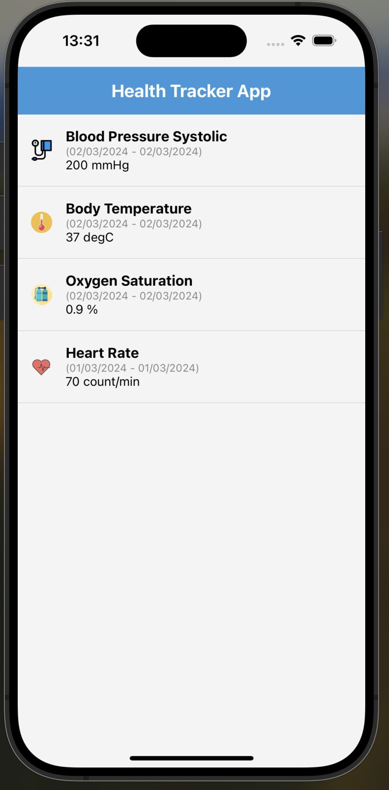
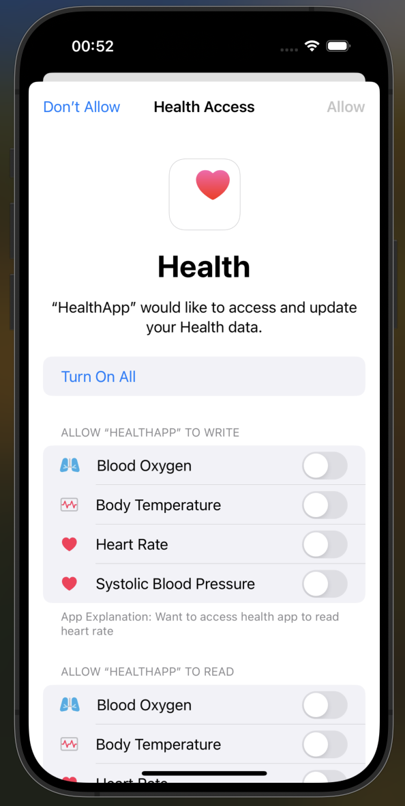

# Health App

The Health App is a React Native project that utilizes HealthKit and Swift to access and display health data from the user's device. It provides a user-friendly interface to track various health metrics such as heart rate, body temperature, oxygen saturation, and blood pressure systolic.

## Features

- **Health Data Visualization:** The app enables users to view their health data in a clear and organized manner.
- **Authorization:** Utilizes HealthKit to request and handle user authorization for accessing health data securely.
- **Dynamic Updates:** Real-time updates ensure that users receive the latest health information.

## Screenshots & Demo

<p align="center">
  
  
  
  
</p>

## Prerequisites

Before running the app, make sure you have the following:

- **Node.js and npm:** Ensure you have Node.js and npm installed on your machine.
- **Xcode or Android Studio:** For iOS development, you need Xcode; for Android, you need Android Studio.
- **HealthKit on iOS:** HealthKit should be available on your iOS device or simulator.
- **Configuration Setup:** Update the '/ios/.xcode.env.local' file with your NODE_BINARY.
- **Simulator Testing:** If running the app on a simulator, ensure HealthKit is added to your capabilities.
- **Logged Data:** Log data in the iOS Health app to see them in the application.


## Installation

1. Clone the repository:

   ```bash
   git clone https://github.com/your-username/health-app.git

   cd health-app

2. Install modules:

   ```bash
   yarn 
   or
   npm i


3. Install Pods:

   ```bash
   npx pod-install

4. Start project:

   ```bash
   yarn start

Hit i to open application in iOS simulator.

## Usage
- Launch the app on your device.
- Grant the necessary permissions to access health data.
- View your health metrics on the intuitive dashboard.

## Possible Improvement
- Restructure project to accomodate test
- Write test
- Add Android support
